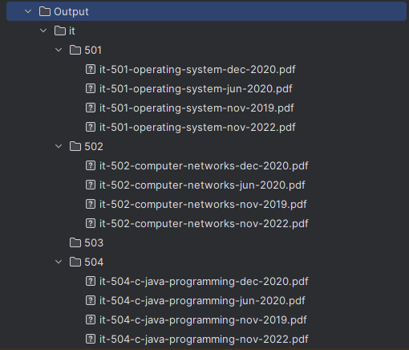
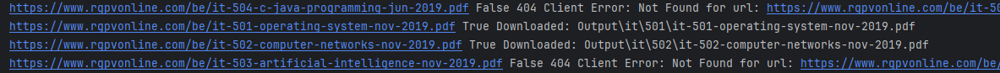

# RGPV Paper Scraper

## Description
This script is designed to automate the process of downloading PDFs from the RGPV website. It is specifically tailored for scraping examination papers and organizes them by branches and subjects. The script can handle different courses and is flexible in terms of the academic year and semester.

## Features
- Downloads PDFs from a specified URL pattern.
- Organizes downloads by branch, subject, and year.
- Supports a range of years and specific months.
## Setup and Installation
### Prerequisites
- Python 3.x
- `requests` library

### Installing Dependencies
To install the required Python libraries, run the following command:

```bash
pip install requests
```
 

## Usage
1. **Setting Up the Script**
   - Open the script with a text editor or IDE.
   - Modify the `subjects` dictionary to include the subjects you want to download.
   - Set the `base_url` to the URL pattern of the PDFs.
   - Adjust the `years` and `months` range according to your needs.

2. **Running the Script**
   - Open your terminal or command prompt.
   - Navigate to the directory where the script is located.
   - Run the script using Python:

   ```bash
   python rgpv_paper_scraper.py
   ```

3. **Output**
   - The downloaded PDFs will be organized in the `Output` folder.

## Project Structure
- `rgpv_paper_scraper.py`: Main script file.
- `Output/`: Directory where downloaded PDFs are stored.

## Customization
You can customize the script for different branches, subjects, years, and months by editing the `subjects` dictionary and the `years` and `months` variables in the script.

## Troubleshooting
If you encounter any issues:
- Ensure all dependencies are installed.
- Check if the URL pattern in `base_url` matches the current URL structure of the RGPV website.
- Verify that the subjects and course codes in the `subjects` dictionary are correct.

## Proof

- Here is the Downloads getting saved.



- Here you can see PDF is getting downloaded and able to fetch from url.



## Contributing
Feel free to fork the project and submit pull requests. For major changes, please open an issue first to discuss what you would like to change.

## License
[MIT](https://choosealicense.com/licenses/mit/)

